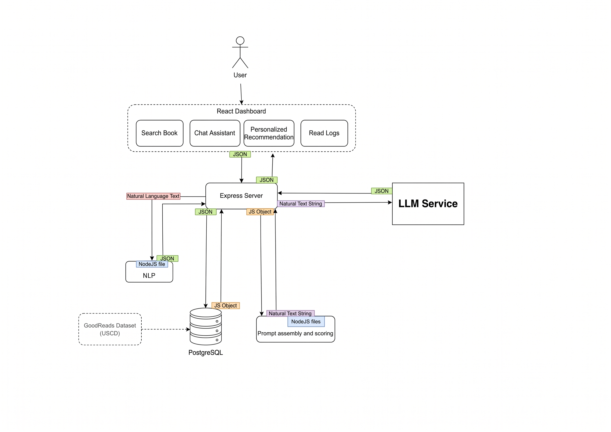
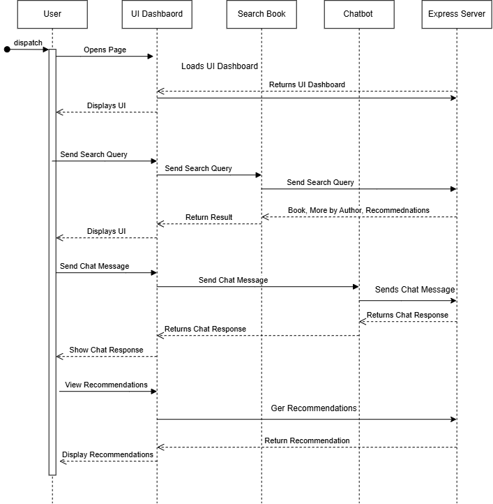
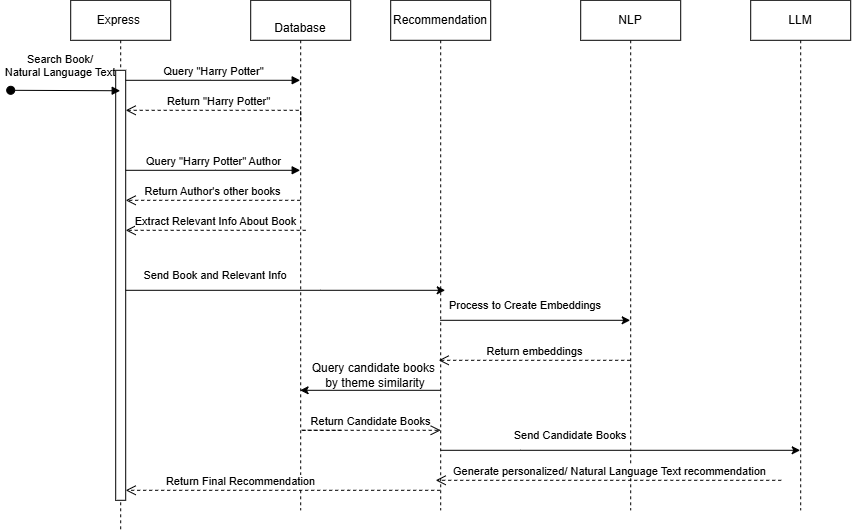

# Reading Companion AI

Reading Companion AI is a personalized reading companion for discovering books, tracking reading progress, and receiving conversational recommendations.

This project is currently in development. The README will be expanded with setup instructions, feature details, and implementation notes as the application progresses.

## Project Documentation

The diagrams below capture the current direction of the system and its main user flows.

### Architecture

The architecture separates the React frontend from the Express backend. The backend is intended to coordinate data storage, recommendation processing, NLP workflows, and the language model integration.



### User interaction flow

This sequence diagram shows how a user interacts with the dashboard, including searching for books, requesting recommendations, and communicating with the reading assistant.



### Recommendation flow

This sequence diagram shows the intended recommendation process, from collecting book and user context to processing that information and returning a personalized recommendation.



## Repository Structure

```text
reading-companion-ai/
├── backend/   Express backend
├── frontend/  React and Vite application
├── docs/      Project diagrams
└── README.md
```